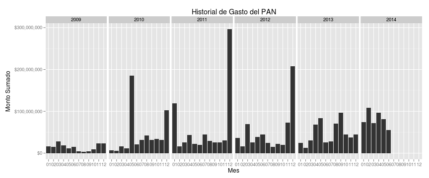
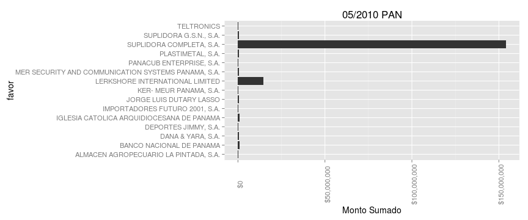
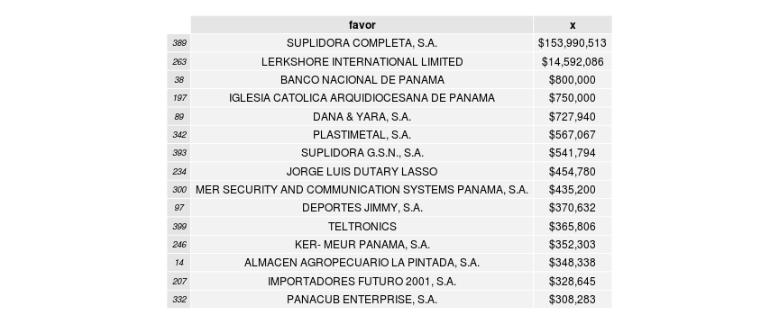
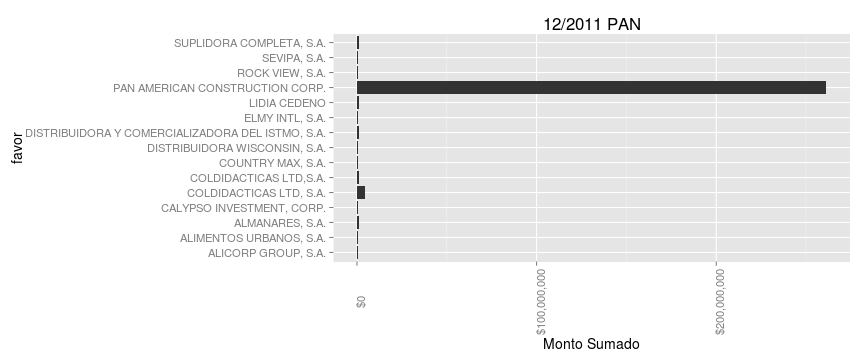
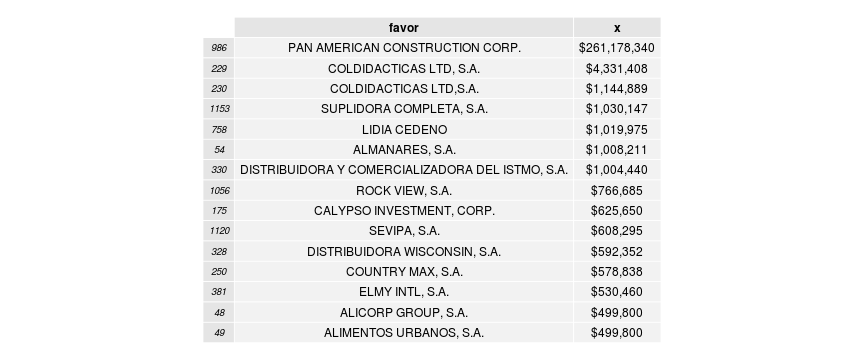
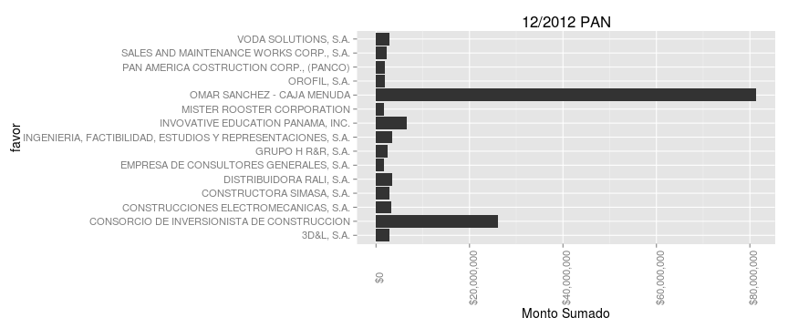
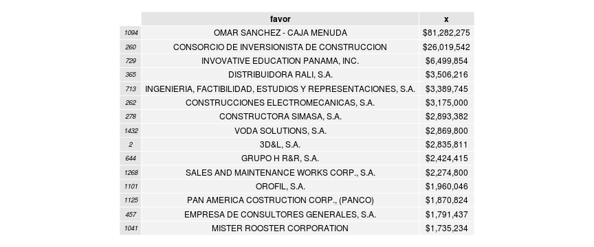
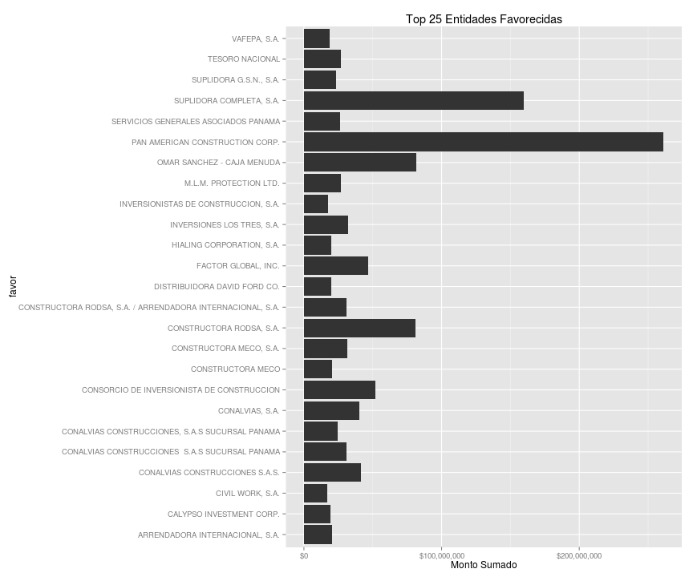

# Investigacion de Gasto del PAN
Los datos fueron extraidos de la pagina de la contraloria (contraloria.gob.pa) utilizando [este programa](https://github.com/ibarria0/chinchorro)


```r
library(ggplot2)
library(scales)
library(grid)
library(reshape2)
library(RCurl)
library(gridExtra)
options(scipen = 100, digits = 4)

# leer y procesar
df <- read.csv("pan.csv", stringsAsFactors = FALSE)
df$date <- as.Date(df$fecha, "%Y-%m-%d %H:%M:%s")
df$year <- format(df$date, "%Y")
df$mon <- format(df$date, "%m")
```


```r
mensual <- aggregate(df[, 2], by = list(mes = df$mon, year = df$year), FUN = sum, 
    na.rm = TRUE)
qplot(mes, x, data = mensual, geom = "bar", stat = "identity", facets = . ~ 
    year) + ylab("Monto Sumado") + xlab("Mes") + ggtitle("Historial de Gasto del PAN") + 
    scale_y_continuous(labels = dollar)
```

 

### Notamos que hay gastos extraodinarios en los meses 05/2010, 12/2011, y 12/2012.


```r
favorecidos <- read.csv("pan_2010.csv")
df <- read.csv("pan_2010.csv")
a <- aggregate(df[, 3], by = list(favor = df$favor), FUN = sum, na.rm = TRUE)
a <- a[order(-a$x), ]
qplot(favor, x, data = head(a, 15), geom = "bar", stat = "identity") + theme(text = element_text(size = 14), 
    axis.text.x = element_text(angle = 90, vjust = 1)) + ylab("Monto Sumado") + 
    coord_flip() + ggtitle("05/2010 PAN") + scale_y_continuous(labels = dollar)
```

 


```r
a$x <- dollar(a$x)
grid.table(head(a, 15), row.names = FALSE)
```

 


```r
favorecidos <- read.csv("pan_2011.csv")
df <- read.csv("pan_2011.csv")
a <- aggregate(df[, 3], by = list(favor = df$favor), FUN = sum, na.rm = TRUE)
a <- a[order(-a$x), ]
qplot(favor, x, data = head(a, 15), geom = "bar", stat = "identity") + theme(text = element_text(size = 14), 
    axis.text.x = element_text(angle = 90, vjust = 1)) + ylab("Monto Sumado") + 
    coord_flip() + ggtitle("12/2011 PAN") + scale_y_continuous(labels = dollar)
```

 


```r
a$x <- dollar(a$x)
grid.table(head(a, 15), row.names = FALSE)
```

 


```r
favorecidos <- read.csv("pan_2012.csv")
df <- read.csv("pan_2012.csv")
a <- aggregate(df[, 3], by = list(favor = df$favor), FUN = sum, na.rm = TRUE)
a <- a[order(-a$x), ]
qplot(favor, x, data = head(a, 15), geom = "bar", stat = "identity") + theme(text = element_text(size = 14), 
    axis.text.x = element_text(angle = 90, vjust = 1)) + ylab("Monto Sumado") + 
    coord_flip() + ggtitle("12/2012 PAN") + scale_y_continuous(labels = dollar)
```

 


```r
a$x <- dollar(a$x)
grid.table(head(a, 15), row.names = FALSE)
```

 


## Entidades Favorecidas

```r
favorecidos <- read.csv("pan_favor.csv")
qplot(favor, sum, data = head(favorecidos, 25), geom = "bar", stat = "identity") + 
    coord_flip() + ylab("Monto Sumado") + ggtitle("Top 25 Entidades Favorecidas") + 
    scale_y_continuous(labels = dollar)
```

 


